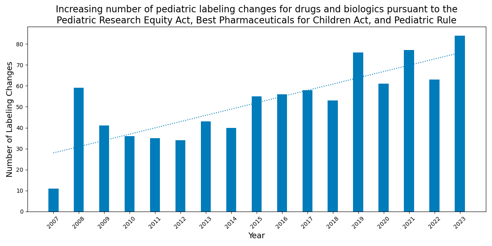

# Pediatric Labeling Changes Database

## Overview
Having information about a medicine’s safety, effectiveness, and dosing for children in the product’s labeling is important to ensure health care professionals can make evidence-based decisions about treating children. A pediatric labeling change refers to any update to a product’s labeling to add information about safety, effectiveness, or dosing for children. Many labeling changes represent a new FDA approval for children, while others provide new safety or efficacy information.

## Motivation

The motivation for creating the Pediatric Labeling Changes Database stems from a desire to ensure that healthcare professionals have access to the most accurate and comprehensive information regarding pediatric medications. Understanding the safety, efficacy, and appropriate dosing for children is crucial for making informed medical decisions. By compiling and regularly updating this database, I aim to support evidence-based pediatric care and compliance with regulatory requirements. This project is driven by a commitment to improve health outcomes for children and to facilitate better understanding and utilization of pediatric drug information.

## Importance and Benefits

### Importance
- **Evidence-Based Decision Making**: This database ensures that healthcare professionals have access to the latest information regarding the safety, effectiveness, and appropriate dosing of medications for pediatric patients, crucial for making informed, evidence-based treatment decisions.
- **Regulatory Compliance**: By aggregating changes mandated by laws like the Pediatric Research Equity Act (PREA), Best Pharmaceuticals for Children Act (BPCA), and the Pediatric Rule, the database serves as a comprehensive resource for compliance with FDA regulations concerning pediatric medicine.
- **Enhanced Pediatric Care**: The inclusion of detailed study characteristics and labeling changes helps in understanding how drugs perform across different pediatric demographics, potentially leading to better health outcomes for children.

### Benefits
- **Centralized Information**: All relevant data is stored in one place, making it easily accessible and reducing the risk of missing critical updates.
- **Data Analysis and Trends**: The structured format allows for analysis over time, identifying trends in pediatric drug approvals, safety updates, or changes in dosing recommendations, guiding future research and policy-making.
- **Historical Reference**: With data dating back to 1998, the database offers a historical perspective on pediatric drug development, useful for academic research, policy analysis, and long-term health strategy planning.
- **Efficiency**: Quick access to detailed information means healthcare providers can spend more time on patient care rather than administrative tasks like document review.
- **Educational Resource**: It serves as an educational tool for medical students, pharmacists, pediatricians, and researchers interested in pediatric pharmacology or regulatory science.
- **Scalability and Updateability**: As new labeling changes occur, they can be easily added to the database, ensuring that the information remains current and relevant.

By making this data readily accessible, this database contributes to a better understanding of pediatric drug development and supports efforts to improve the health and well-being of children.

## Legislation and Impact
The pediatric labeling changes and study characteristics data highlight key pediatric information obtained from studies submitted to the FDA in response to legislative initiatives, including:
- **Pediatric Research Equity Act (PREA) of 2003**
- **Best Pharmaceuticals for Children Act (BPCA) of 2002**
- **Pediatric Rule of 1998**

These laws encourage and, in certain circumstances, require pharmaceutical companies to develop medicines for children, leading to a significant increase in pediatric studies and new treatment options for children.

## Pediatric Labeling Changes 2007 – 2023
The graph below shows the number of labeling changes for pediatric populations under certain federal laws. The number of pediatric labeling changes includes each individual label change approved by the FDA. One product may undergo several pediatric labeling changes.

**Note:** This section will be updated quarterly.

## Data Spreadsheets
### Pediatric Labeling Changes Spreadsheet
This spreadsheet contains all pediatric labeling changes made under BPCA, PREA, and the Pediatric Rule since 1998. Each pediatric labeling change includes:
- FDA Application Number(s)
- Pediatric Labeling Date
- Trade Name
- Generic Name
- Type of Legislation
- Indication
- Indication(s) Studied
- Labeling Change Summary
- Therapeutic Category
- Dosage Form(s)
- Route(s) of Administration
- Studied in Neonates
- Indicated in Neonates

[Download Pediatric Labeling Changes Spreadsheet (XLSX - 311 KB)](https://www.fda.gov/media/175738/download?attachment)

### Pediatric Study Characteristics Spreadsheet
This spreadsheet contains pediatric study characteristics for clinical trials conducted to support each pediatric labeling change, including:
- FDA Application Number(s)
- Pediatric Labeling Approval Date
- Trade Name
- Generic Name
- Type of Legislation
- Indication
- Indication(s) Studied
- Labeling Change Summary
- Therapeutic Category
- Dosage Form(s)
- Route(s) of Administration
- Pharmacological Class
- Studied in Neonates
- Indicated in Neonates
- Product Labeling Link
- Study Number
- Ages Studied
- Study Type
- Study Design
- Patients Enrolled
- Patients Analyzed
- Number of Centers
- Number of Countries
- Total # of Hispanic/Latino
- Total # of Non-Hispanic/Non-Latino
- Total # of Unknown Ethnicity
- Total # of Asian
- Total # of Black
- Total # of White
- Total # of Native Hawaiian or Pacific Islander
- Total # of American Indian/Alaska Native
- Total # of Other Race
- Total # of Unknown Race
- Country Names
- Notes

[Download Pediatric Study Characteristics Spreadsheet (XLSX - 425 KB)](https://www.fda.gov/media/175739/download?attachment)

## Entity-Relationship Diagram
The diagram below shows the relationships between the tables in the database using Chen's notation. Primary keys are underlined and color-coded for easier coding reference.

## Updates
This database will be updated regularly to include the latest pediatric labeling changes and study data. Note that updates may not always coincide with the FDA's quarterly updates; the most up-to-date information can be obtained by running the code yourself.

## Conclusion
The data provided offers valuable insights into pediatric labeling changes and helps ensure that health care professionals can make informed decisions about treating pediatric populations.
